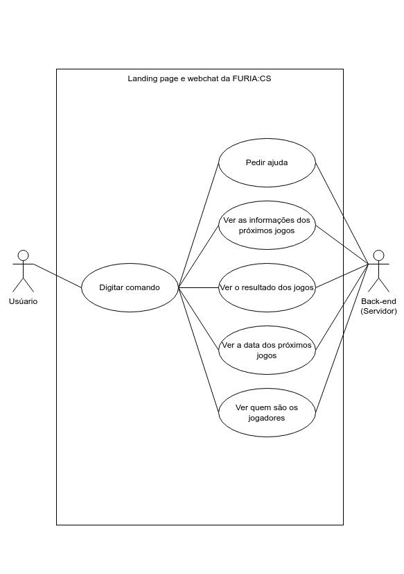

# Desafio #1: Experiência Conversacional

[[Voltar ao Desafio Técnico]](../README.md)

## Índice

- [Objetivo](#objetivo)
- [Tecnologias Utilizadas](#tecnologias-utilizadas)
- [Estrutura do Projeto](#estrutura-do-projeto)
- [Funcionalidades](#funcionalidades)
- [Diagramas](#diagramas)
- [Como utilizar o projeto?](#como-utilizar-o-projeto)
    - [Instalação](#instalação-do-projeto)
    - [Resultados](#resultados)
    - [Comandos do Chatbot](#comandos-do-chatbot)
<!-- - [Aprendizados](#aprendizados) -->
<!-- - [Licença](#licença) -->

## [Objetivo](#índice)

> Desenvolver um caso de uso conversacional relacionado à FURIA (Telegram, web chat ou mobile chat).

> O chat para os fãs do time de CS da FURIA deve conter tudo que o fã gostaria de ver para acompanhar e interagir com o time.

## [Tecnologias Utilizadas](#índice)


- HTML5
- CSS3
- JavaScript (ES6)
- Bootstrap 5
- Node.js
- Express
- EJS

## [Estrutura do Projeto](#índice)

O referente projeto esta organizado seguindo o modelo MVC de desenvolvimento web:

```
.
├── nodemon.json
├── package.json 
├── package-lock.json
├── /public
│   # Pasta com os arquivos estático como css, javascript e images
│
├── README.md
├── server.js
└── /src
    ├── app.js
    ├── /controllers
    │   # Pasta com os controladores das rotas
    │
    ├── /routes
    │   # Pasta com as configurações das rotas
    │
    └── /views
        │   #Pasta com os arquivos html/ejs do projeto
        │
        ├── /chat
        │   #Pasta com os arquivos do webchat/chatbot
        │
        ├── /components
        │   # Pastas com os componentes da página
        │
        ├── index.ejs
        │   # Arquivo da pagina principal
        │
        ├── layout.html
        │   # Arquivo de layout da página principal
        │
        └── /sections
            # Seções da landing page
```

## [Funcionalidades](#índice)

- Chatbot com respostas interativas
- Interface responsiva com Bootstrap
- Minimizar/expandir chatbot
- Histórico de mensagens (até recarregar a página)
- Navegação pelas seções da landing page

## [Diagramas](#índice)

> 

## [Como utilizar o projeto?](#índice)

### [Instalação do projeto:](#índice)

Após instalar o NodeJS e o git, utilize os seguintes comando no terminal:

1. Clone o projeto utilizando git ou fazendo o download dos arquivos no github

```bash
git clone https://github.com/DHDC-21/furia.git
```

2. Entre na pasta do desafio 1

```bash
cd ./furia/challenge_1
```

3. Utilize os seguintes os comando `npm i` ou `npm install` para instalar o node modulos

4. Inicie o projeto

```bash
npm start
```

5. Acesso o navegador com o seguinte endereço

```bash
http://localhost:3000
```

### [Resultados](#índice)


### [Comandos do Chatbot](#índice)

> Abaixo estão os principais comandos do chatbot:

```plaintext
help         → Mostra todos os comandos disponíveis
furia        → Informações sobre a equipe de CS:GO da FURIA
jogadores    → Lista dos jogadores do time de CS:GO da FURIA
partida      → Informa sobre a próxima partida
redes        → Compartilha os links para redes sociais oficiais
```

<!-- ## [Aprendizados](#índice) -->
<!-- ## [Licença](#índice) -->